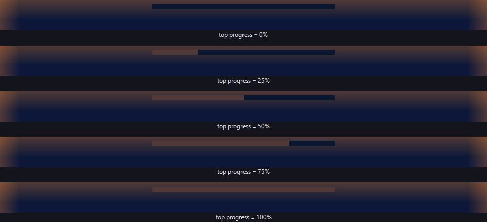

<p align="center">
  
</p>

<h1 align="center">弹性呼吸 (ElasticBreath)</h1>

<p align="center">
  基于 C# / WPF / .NET 8 的本地休息引导工具<br/>
  用边缘视觉与弹性时间窗口提供"不可习惯化"的休息引导，绝不强制打断关键操作
</p>

<p align="center">
  
  
  
  
</p>

---

**弹性呼吸（ElasticBreath）** 摒弃传统"倒计时炸弹"模型，采用**水位预警模型**：工作时长分为安全 / 预警 / 硬性三档，休息分为基础 / 弹性 / 超时三档，视觉强度随档位渐进。自动状态切换先调度倒计时、条件不满足自动取消，绝不强制打断关键操作；核心原则是**永不阻断中心视野**——无模态弹窗、不抢焦点、不黑屏。

## 核心特性

- **水位预警模型**：摒弃"倒计时炸弹"模型，工作时长分为安全 / 预警 / 硬性三档，休息分为基础 / 弹性 / 超时三档，视觉强度随档位渐进，而非到点爆炸。
- **弹性时间窗口**：自动状态切换不是瞬时执行，而是先调度一段待处理倒计时；每秒复检触发条件，条件不满足则自动取消；用户也可点击通知卡片主动取消，避免在关键操作时被强制打断。
- **双向智能感知**：基于系统空闲时长与密集输入持续时长，自动识别用户离开与归来，无需手动启停。
- **左上角悬停触发**：将鼠标悬停在屏幕左上角达阈值即可静默切换工作 / 休息状态，无需点击；悬停时角落会浮现半透明圆提示进度（由灰渐变为绿，变绿瞬间切换，切换后保持绿色直至移开鼠标）；触发后必须离开左上角才允许下一次触发，防止手抖连发。
- **会话锁屏处理**：锁屏时强制进入空闲态、清零周期计时并清除待处理切换；解锁后保留状态，按活动自然恢复。
- **无效休息不重置工时**：休息时长不足"最小有效休息"阈值时，切回工作会把"休息前工时 + 本次休息时长"作为新工时，防止随手切换就清零工时。
- **检测时间计入计时**：自动切换的检测时长（如 30 秒空闲判定）会回算进休息起点，计时不丢精度。
- **检测探测进度显示**：无待处理切换时，主窗口实时显示"还需持续 X 秒才会触发"，把不可见的智能判定可视化。
- **跨自然日累计重置**：检测到本地日期变更时清零今日工作 / 休息累计，"今日累计"语义正确。
- **边缘呼吸光晕**：通过 Win32 分层窗口（`UpdateLayeredWindow`）+ 手写 `byte*` 像素直填，绕过 WPF 渲染管线在屏幕四周绘制渐变光晕与顶部进度条，仅作用于边缘视觉，永不阻挡中心视野；颜色随状态映射（橙=预警、红=硬性、绿=休息、灰=暂停）。
- **多屏自适应 + 全屏回退**：单屏极简、多屏增强（副屏边框闪烁）、全屏隐匿三种模式自动适配；检测到全屏前台占用时回退到任务栏闪烁 + 5 秒间隔提示音，不打扰观影 / 游戏。
- **永不抢焦点**：浮层加 `WS_EX_NOACTIVATE | WS_EX_TOOLWINDOW | WS_EX_TRANSPARENT`，永不抢键盘焦点、不进 Alt+Tab、鼠标点击穿透到下层窗口，对键盘用户与辅助技术零干扰。
- **低帧率 + 跳帧缓存**：动画定时器 200ms（约 5 FPS），缓存上一帧像素，未脏且颜色未变时直接跳过提交，CPU 占用极低。
- **三层全局异常守卫 + 本地崩溃日志**：`DispatcherUnhandledException` / `AppDomain.UnhandledException` / `TaskScheduler.UnobservedTaskException` 全部接管并落盘；崩溃日志仅写入本地 `%TEMP%`，含时间 / OS / 运行时 / 堆栈，由用户自行决定是否提交。
- **纯本地 / 无遥测 / 无网络请求**：无遥测、无崩溃自动上报、无第三方分析或广告 SDK；仅读取系统输入时间戳与进程标识，不记录按键内容、不截屏外发。
- **算术表达式配置**：时长字段支持 `35*60` 这类可读表达式，由自实现的递归下降求值器解析；加载时求值、保存时原文回写，配置文件始终保留人类可读形式；设置带字段间依赖约束与范围 Sanitize，防止非法配置。
- **中英双语**：基于 JSON 的国际化方案，内置 zh-CN 与 en-US 语言包，从 `i18n/` 目录自动发现，缺失键回退兜底。
- **不可变快照 + 分层架构**：领域模型（Domain）纯数据、服务层（Services）无 UI 依赖可独立测试、互操作（Interop）P/Invoke 集中管理；引擎每秒构造不可变 `EngineSnapshot` 经事件单向流出，UI 只读映射。
- **渲染核心抽离为跨平台纯逻辑库**：像素渲染逻辑独立为 `ElasticBreath.Rendering`（net8.0，无 WPF / Win32 依赖），主应用的分层窗口与离线截图工具共用同一渲染核心，保证 README 截图与实机像素级一致。
- **便携免安装 / 不写注册表**：单文件便携版，解压即用，配置写 exe 同级 `config/settings.json`，卸载只需删文件夹。

## 截图

以下图像均由 [`ElasticBreath.DemoRenderer`](ElasticBreath.DemoRenderer/) 离线生成，复用与实机 Layered Window 相同的 [`EdgeOverlayPixelRenderer`](ElasticBreath.Rendering/EdgeOverlayPixelRenderer.cs) 渲染核心，与实机像素级一致。背景为合成渐变壁纸，不含任何真实桌面、任务栏或窗口内容。

### 边缘呼吸光晕（Warning 脉冲，3 秒一个周期）


### 六种状态

| 状态 | 说明 | 截图 |
|---|---|---|
| Warning | 工作预警：橙色边缘光晕，3 秒慢脉冲 |  |
| Hard | 工作硬性：红色边缘光晕，1 秒快脉冲 |  |
| RestBase | 休息基础：绿色边缘光晕 |  |
| RestElastic | 休息弹性：亮绿边缘光晕，1.8 秒脉冲 |  |
| RestOvertime | 休息超时：亮绿 + 闪烁，提示已超时 |  |
| Paused | 暂停：灰色弱透明边缘光晕 |  |

### 顶部进度条（不同填充比例）



> 重新生成所有图片：
>
> ```powershell
> # 合成渐变壁纸（默认，零隐私风险）
> .\scripts\render-demo.ps1
>
> # 或双击 DemoRenderer 可执行文件（ElasticBreath.DemoRenderer.exe），
> # 按提示输入背景图路径（直接回车用合成壁纸）后自动生成全部图片
>
> # 用自定义背景图测试效果（输出文件名带 --<basename> 后缀，不会覆盖默认版本）
> .\scripts\render-demo.ps1 -Bg D:\wallpapers\1.jpg
>
> # 批量测试多张背景图
> Get-ChildItem D:\bg\*.jpg | ForEach-Object { .\scripts\render-demo.ps1 -Bg $_.FullName -NoBuild }
> ```
>
> 也支持直接调用：`dotnet run --project ElasticBreath.DemoRenderer/ElasticBreath.DemoRenderer.csproj -c Release -- --bg <图片路径> --out <输出目录>`（`--help` 查看完整用法）

## 系统要求

- 操作系统：Windows 10 / 11 64-bit
- 运行时：.NET 8 运行时（使用自包含发布版时无需单独安装运行时）

## 快速开始

**方式一：从源码构建运行**

```bash
git clone <repo-url> ElasticBreath
cd ElasticBreath
dotnet build ElasticBreath.sln
dotnet run --project ElasticBreath.App/ElasticBreath.App.csproj
```

**方式二：下载便携版**

从 Releases 页面下载便携版 zip，解压后直接运行 `ElasticBreath.exe`，无需安装，不写注册表。

## 配置说明

配置文件位于 `config/settings.json`，所有时长字段均以可读的算术表达式存储，例如 `"35*60"` 表示 35 分钟（2100 秒），保持配置文件的人类可读性，便于审阅与手动调整。

常用配置项也可通过应用内的设置界面（`SettingsWindow`）修改，保存时会自动写回 `config/settings.json`。

## 项目结构

```
ElasticBreath/
├── ElasticBreath.App/
│   ├── Domain/                  # 领域模型：设置、状态枚举、不可变引擎快照
│   │   ├── ElasticBreathSettings.cs
│   │   ├── ElasticBreathState.cs
│   │   └── EngineSnapshot.cs
│   ├── Services/                # 服务层：状态机、输入监测、本地化、设置存储等
│   │   ├── BreathEngine.cs                   # 休息引导状态机
│   │   ├── InputMonitor.cs                   # 基于 GetLastInputInfo 的空闲检测
│   │   ├── CornerTriggerService.cs           # 角落悬停触发
│   │   ├── DisplayTargetService.cs           # 显示目标 / 多屏适配
│   │   ├── LocalizationService.cs            # JSON 国际化
│   │   ├── SettingsStore.cs                  # 设置持久化（算术表达式）
│   │   ├── SessionMonitor.cs                 # 会话 / 登录状态监测
│   │   ├── SecondaryMonitorFlashService.cs   # 副屏闪烁增强
│   │   ├── RemoteInputFilterService.cs       # 远程控制工具过滤
│   │   ├── ExpressionEvaluator.cs            # 算术表达式求值
│   │   └── CrashLogger.cs                    # 崩溃日志（仅本地）
│   ├── UI/                      # UI 层：各类 WPF 窗口
│   │   ├── EdgeOverlayWindow.xaml(.cs)              # 边缘呼吸光晕分层窗口
│   │   ├── CountdownNotificationWindow.xaml(.cs)    # 倒计时通知
│   │   ├── ToastWindow.xaml(.cs)                    # 悬浮提示（无"关闭"出口，只能"完成"）
│   │   ├── SettingsWindow.xaml(.cs)                 # 设置界面
│   │   └── HelpWindow.xaml(.cs)                     # 帮助界面
│   ├── Interop/                 # Win32 P/Invoke 互操作
│   │   └── Win32Native.cs
│   ├── i18n/                    # 国际化语言包（自动发现）
│   │   ├── zh-CN.json
│   │   └── en-US.json
│   └── Properties/
│       └── PublishProfiles/
│           └── Portable.pubxml  # 便携单文件发布配置
├── ElasticBreath.Rendering/     # 渲染核心：纯逻辑无平台依赖，主项目与离线工具共用
│   ├── EdgeOverlayPixelRenderer.cs
│   └── ElasticBreath.Rendering.csproj
├── ElasticBreath.DemoRenderer/  # 离线截图生成工具：复用渲染核心生成 README 用图
│   ├── Program.cs
│   └── ElasticBreath.DemoRenderer.csproj
├── docs/
│   └── screenshots/             # DemoRenderer 生成的展示图（PNG/GIF）
├── scripts/
│   ├── build-release.ps1        # 发布构建脚本
│   └── render-demo.ps1          # 展示截图生成脚本（支持自定义背景图）
├── design.md                    # 设计文档
├── STATE_MACHINE.md             # 状态机说明
├── implementation.md            # 实现说明
└── ElasticBreath.sln
```

## 构建与发布

构建解决方案：

```bash
dotnet build ElasticBreath.sln
```

发布便携单文件版本：

```bash
dotnet publish ElasticBreath.App/ElasticBreath.App.csproj -c Release -p:PublishProfile=Portable
```

也可使用项目内置的发布脚本：

```powershell
./scripts/build-release.ps1
```

## 文档导航

- [设计文档](design.md)
- [状态机说明](STATE_MACHINE.md)
- [实现说明](implementation.md)
- [用户指南](USER_GUIDE.md)
- [架构说明](ARCHITECTURE.md)
- [贡献指南](CONTRIBUTING.md)
- [更新日志](CHANGELOG.md)
- [安全策略](SECURITY.md)

## 贡献

本项目由 [@Stargazed-Dreamer](https://github.com/Stargazed-Dreamer) 独立开发与维护，欢迎参与贡献，请先阅读 [贡献指南](CONTRIBUTING.md)。

## 许可证

本项目基于 [MIT License](LICENSE) 开源。

Copyright (c) 2026 Stargazed-Dreamer
